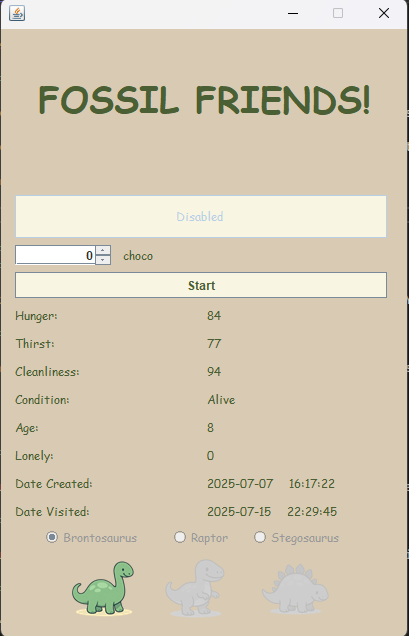
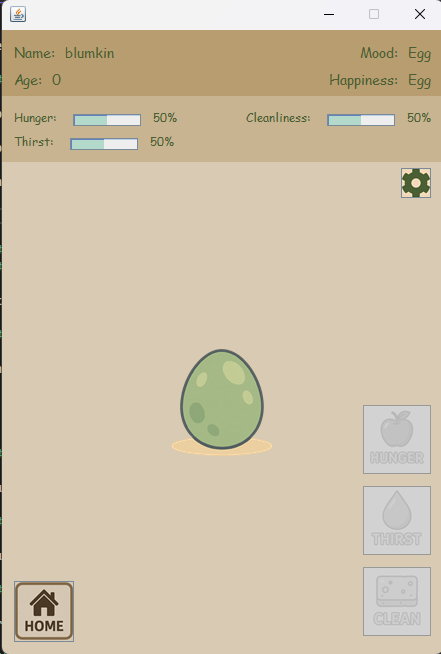
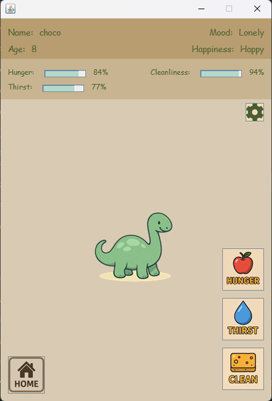
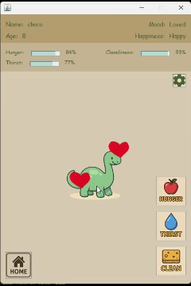
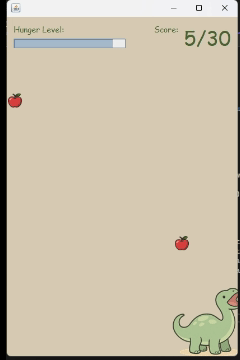
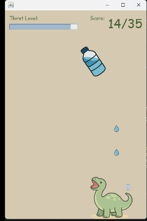
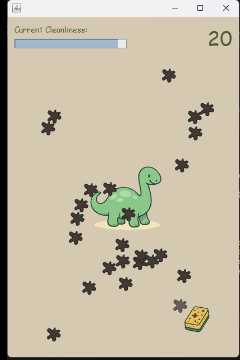
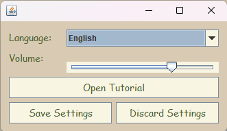
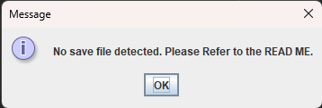

# FOSSIL FRIENDS #

Below includes a full guide for Fossil Friends:

## Table of Contents ##
1. [About](#about)
1. [Features](#features)
1. [Screenshots](#screenshots)
1. [Installation](#installation)
1. [System Requirements](#system-requirements)
1. [How to Play](#how-to-play)
1. [Saving and Data](#saving-and-data)
1. [Notes and Warnings](#notes-and-warnings)
1. [Common Errors](#common-errors)
1. [License](#license)
1. [Contact and Feedback](#contact-and-feedback)

## About ##

Fossil Friends is a virtual pet simulation game built using JAVA and SQL tables. It is inspired by classic Tamagotchi-style games and allows players to hatch, raise, and care for their very own dinosaur companion.

You'll be responsible for managing your dino's hunger, thirst, cleanliness, and loneliness. Each of these affects the dinosaur's overall happiness and survival. The game features real-time stat decay (even when offline), interactive minigames, animated feedback, and persistent saving via a local SQL database.

This is designed as my Grade 12 IEB IT PAT project. 

## Features ##
### Hatch your Dinosaur ##

Start your journey by hatching a dinosaur from an egg. You are able to choose between 3 different types of dinosaurs with unique visuals: brontosaurus, raptor, and stegosaurus. 

### Interactive Minigames ###

There are dedicated minigames to manage your pet's needs:
	- Catch apples to feed your dino (Hunger)
	- Pour water droplets for your dino (Thirst)
	- Scrub away dirt spots with a sponge (Cleanliness)

### Real-Time Stat Management ###

Hunger, thirst, cleanliness, and loneliness stats decrease over time, even while offline, which encourages regular care.

### Clean, Custom GUI ###

Built using JAVA Swing, with a cute, cartoonish aesthetic and tailored layout for both playability and charm.

### Persistent Save System ###

Progress is saved using an included Access SQL database (.accdb), with automatic recovery if no save tables are found in the file.

### Pet Happiness and Mood ###

Your dinosaur reacts to how well you take care of it. High loneliness or neglect can lead to faster stat degradation which can lead to death. Regular interaction improves its mood and happiness.

### Petting Mechanic ###

Click your dinosaur to show it affection and reduce loneliness. Animated heart effects shows the dinosaurs love.

### Aging system ###

Your dinosaur ages in real-time, once per day.

### Multi-language Support ###

Fully playable in English, Afrikaans, and Zulu, selected from the settings.

### Minigame Cooldown ###

After playing a minigame, it temporarily locks to avoid spamming.

## Screenshots ##

## Installation ##

1. 	Unzip the folder inside the `BUILD` directory. The structure should look like this:

	`	FossilFriends/`

		`   ├── FossilFriends.jar`

		`   ├── FossilFriendsSaves.accdb`

		`   └── lib/`
	
			`       ├── commons-lang3-3.8.1.jar`

			`       ├── commons-logging-1.2.jar`

			`       ├── hsqldb2.5.0.jar`

			`       ├── jackcess-3.0.1.jar`

			`       ├── rs2xml.jar`

			`       └── ucanaccess-5.0.1.jar`

2. 	Open 'FossilFriends.jar' to start the game. 
	--If you encounter prompts for which application to use, ensure that **JAVA 17.0.12** is installed.

	you can download JAVA 17 from:
	https://www.oracle.com/java/technologies/javase/jdk17-archive-downloads.html

FOR MAC:
- if you encounter an error saying that Apple couldn't verify the integrity of this application follow these instructions:
	1. Ensure you have the above structure correct and have unzipped the files.
	2. Ensure that the program is not in an icloud drive.
	3. Open terminal and run these commands:
			
			cd /your_file_path
			
			xattr -d com.apple.quarantine FossilFriends.jar
- If FossilFriends.jar still isn't open, ensure you have the correct Java version.

## System Requirements ##
	
	MINIMUM:
	OS		Windows 7 SP1 or newer (64-bit)
	CPU		Dual-core processor
	RAM		2GB
	STORAGE		10MB free disk space
	JAVA VERSION	17.0.12

	It is highly recommended to use a 1920x1080 resolution.

## How to Play ##

### Login Page ###

 - Select your save.
 - Input a name and type of dinosaur if creating a new save.
 - Start the game.

### Game Screen ###

 - All your stats are displayed in the top header
 - Crack open your dinosaur egg to reveal your new pet.
 - Pet the dinosaur by clicking on it. This reduces it's loneliness, but be careful as you might overwhelm your dinosaur.
 - Settings icon in the top right to adjust volume, language, and to access the tutorial again.
 - Minigame buttons take you to your respective minigame.
 - Home button to take you to the LoginPage.

### Hunger Game ###

 - A total of 30 apples will drop.
 - you control your dinosaur with your mouse to catch the falling apples.

### Thirst Game ###
 
 - A total of 35 drops will fall out of your water bottle.
 - You control a water bottle and you have to time it correctly so it drops onto your dinosaur as it moves side to side.

### Clean Game ###

 - A total of 25 dirt spots will appear on your dinosaur
 - You will control a sponge to clean off your dirt spots.

## Saving and Data ##

Fossil Friends uses a local Microsoft Access (.accdb) database to store and manage all game progress.

### Save Features ###

 - Automatic Saving: The game saves your dinosaur during every second.
 - Persistent Progress: Even when you close the game, your dinosaur's state is remembered and updated the next time you launch.
 - Multiple Save Slots: You can manage multiple dinosaurs using different save slots.
 - Manual Save Fallback: If autosaving fails (such as a missing table inside the database) the game will attempt to recover or recreate the table.

### Database Details: ###

 - Save data is stored in `FossilFriendsSaves.accdb`, located in the same folder as the `.jar` file.
 - The game uses the UCanAccess JDBC driver to connect to the database.
 - If the database is missing, the game will show an error and safely exit - instructions will be provided later in this document. 

## Notes and Warnings ##

 - Do not rename or remove any files in the `lib` folder.
 - All save data is stored in the `FossilFriendsSaves.accdb` file. Deleting this file will erase all progress.
 - Saving occurs frequently and automatically, so progress is rarely lost even if the game is closed unexpectedly.
 - The game is optimized to minimize lag during saving, even when on slower storage devices (such as USB Flash Drives).

## Common Errors ##
### 1. No Save File ###

If this error is shown, create a .accdb file named `FossilFriendsSaves` in the root folder, next to the .jar file.

## License ##

This project is licensed under the [MIT License](LICENSE).
You are free to use, modify, and distribute this software with proper credit.

## Contact and Feedback ##

Created by **Damian Nell** for the Grade 12 IEB IT PAT.  
For questions, feedback, or bug reports, please:

- 📧 Email: [damian.nell2203@gmail.com](mailto:damian.nell2203@gmail.com)
- 🐛 Report issues on [GitHub](https://github.com/Damian-Nell/FossilFriends/issues)